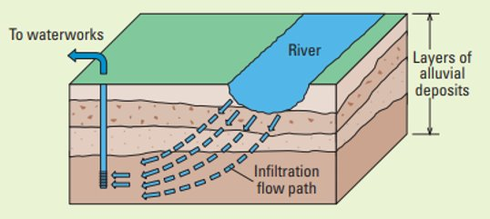

# Introduction

Groundwater is an important source of freshwater for the global population. Groundwater has an agricultural use as well as industrial use. Households use groundwater for drinking purposes. Therefore, contaminated groundwater will have a major influence on the health of the global population, but it will also have an effect on ecological services (Li et al., 2021).   
Nowadays, the contamination of groundwater and surface water is a significant problem. Contamination of groundwater and surface water occurs due to the addition of undesirable contaminants. Wastewater from industries is a main source of the contamination, but also the fertilization and animal waste cause the ground and surface water to become contaminated with a wide range of substances (Li et al., 2021) (McDonough et al., 2020).
Groundwater can become contaminated directly, but it can also become contaminated through the entering of contaminated surface water into the groundwater. When the water level of the surface water is higher than the piezometric head of the aquifer, water will enter the aquifer. When it is the other way around, groundwater will enter the surface water. 

Many technologies are developed to treat groundwater with degraded quality. These are processes like membrane filtration, in which particles and macromolecules are mechanically and chemically separated with a membrane, and advanced oxidation, in which a set of chemical procedures cause effluents to be removed from the groundwater. Nowadays, riverbank filtration, which is a relatively old method, is increasingly used, figure \ref{fig:intro}. 

{width=70%}

This method is based on the exposure of groundwater to various processes such as adsorption, reduction, physicochemical filtration, and biodegradation. The groundwater becomes relatively consistent in quality (Tufenkji et al., 2002). 

At the interface between groundwater and surface water, there is an occurrence of strong redox gradients. Heterogeneous spatial and temporal patterns of electron acceptors and electron donors have emerged in this zone. Also, the concentrations of biogeochemically important solutes vary widely. This results in a complex pattern of redox reactions occurring in this zone (Dahm et al., 1998). 
Other types of reactions that occur in the hyporheic zone are weathering reactions, but also ion exchange and gas exchange play a prominent role in this zone (Tufenkji et al., 2002). 

The advective exchange of surface water with a high concentration of the pollutant DOM is one important issue that needs to be addressed. Groundwater cannot be used as drinking water when its DOM concentration is substantially high. DOM in groundwater contributes to a strong odor as well as a deterioration of the taste of the water (Tufenkji et al., 2002). 
DOM is a pool of organic molecules that have various origins, autochthonous as well allochthonous. In remote rivers, the DOM is not influenced by humans. However, there is a natural background concentration of DOM in these rivers. In urbanized rivers, the DOM concentration is affected by the inputs of treated as well as untreated wastewater. Also, agricultural and industrial land use have increased the DOM levels in surface water substantially (Meng et al., 2013). 

In this paper, the processes connected to the nitrogen cycle in DOM mineralization are examined. Three different processes involved in the nitrogen cycle are taken into account. The first process is aerobic respiration. In this process, DOM is mineralized by microbes using oxygen as an electron acceptor. Aerobic respiration is the most exergonic metabolic process known (Han et al., 2011). 
The second process involved is denitrification. Denitrification has a lower redox potential than aerobic mineralization. Therefore, it will occur after most of the oxygen has become depleted. In denitrification, nitrogen oxides are used as electron acceptors. In this denitrification reaction nitrate is the main electron acceptor for denitrification (Knowles, 1982). 
The third process involved is nitrification. Nitrification is a second-order process, in which ammonium is oxidized to nitrate. Nitrite is an intermediate product in this conversion. The nitrification process results in the re-generation of nitrate, which can be used again in the process of denitrification (Alexander, 1965). 

The main objective of this paper is to investigate if groundwater is suitable for human consumption after riverbank filtration. The different nitrogen components have a certain concentration threshold. This threshold must not be exceeded for drinking water to be suitable for human consumption. In RStudio a model run is done to examine the concentrations of different nitrogen components along the aquifer. Also, a sensitivity analysis is done to examine the influence of DOM concentration on other model components. 

To meet this objective, the following research questions are addressed in this paper: 
What is the reason for the shapes of the concentration-length profiles of the different state variables of the model? 
What are the flux amounts between the different compartments of the model? 
What is the suitability of groundwater for human consumption along the aquifer based on the different threshold values of the different compartments. 
How does the DOM concentration affect the suitability for human consumption based on the sensitivity analysis. 

