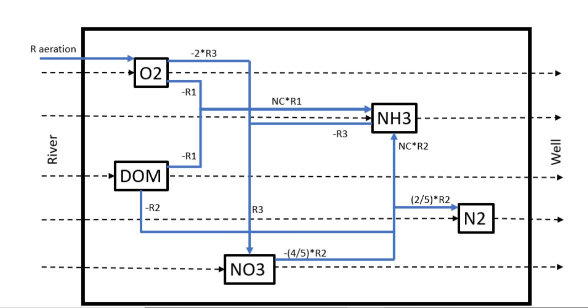

```{r, message = FALSE, echo=FALSE}
require(marelac)
require(ReacTran)
```

# Methods

## State Variables
To be able to model the processes involved we need to quantify the state variables and the reaction processes between them. We differentiate between 5 different state variables with a starting concentration of zero. The state variables are DOM, $NO_3$, $NH_3$, $O_2$, and $N_2$. These are connected by 3 biochemical reactions that were already mentioned: mineralisation, denitrification, and nitrification. 

## The model grid and associated properties

Define the model grid and model parameters that vary in space.

```{r}
# units: time=days, space=meters, amount=moles, concentration=mol/m3

# spatial domain
Length    <- 500    # [m]
N         <- 250    # number of grid cells

# grid with equally sized boxes (not used here, see next R-command)
Grid      <- setup.grid.1D(L = Length, N = N)

# initial conditions
DOM.ini   <- rep(0, length = N) 
NO3.ini   <- rep(0, length = N)
NH3.ini   <- rep(0, length = N)
O2.ini    <- rep(0, length = N)
N2.ini    <- rep(0, length = N)
state.ini <- c(DOM.ini, NO3.ini, NH3.ini, O2.ini, N2.ini)
SVnames   <- c("DOM", "NO3", "NH3", "O2", "N2")
nspec     <- length(SVnames)
```

## Model Parameters
The model parameters for the model
```{r}
parms <- c(
 v        = 10*(24/100),   # [m/d]         the velocity of groundwater
 a        = 1.5,           # [m]           the dispersivity of the aquifer 
 por      = 0.4,           # [-]           average porosity of the aquifer
 NC       = 16/106,        # [-]           Redfield ratio C -> N
 rA       = 0.002*24,      # [/d]          the aerobic respiration rate constant
 kO2      = 20/1000,       # [mol/m3]      affinity constant for O2 substrate
 rD       = 0.002*24,      # [/d]          the denitrification rate constant
 kNO3     = 35/1000,       # [mol/m3]      rate limitation for No3
 rNitri   = 0.36*24,       # [/(mol/m3)/d] nitrification rate constant
 rAer     = 0.0003*24,     # [/d]          the aeration constant
 DOMriver = 0.5,           # [mol/m3]      the concentration of DOM in the river
 O2river  = 210/1000,      # [mol/m3]      the concentration of the oxygen in the river
 NO3river = 100/1000,      # [mol/m3]      the concentration of NO3 in the river
 NH3river = 0/1000,        # [mol/m3]      the concentration of NH3 in the river
 N2up     = 0/1000         # [mol/m3]      the concentration of N2 in the air
)


# calculate the oxygen solubility

O2satmm <- gas_solubility(S = 0, t = 10, species = "O2")      #mmol/m3/bar
O2sat <- O2satmm/1000*0.21                                         #mol/m3/bar
# partial pressure. bar is gehele atmospheric pressure. *21% is only the o2 in de atmosfeer

```

## Reactions in the Aquifer
DOM mineralization occurs via aerobic respiration. In the mineralisation reaction, the dissolved organic matter is converted with oxygen to produce carbon dioxide, water, and ammonium. Both carbon dioxide and water are not used in other reactions and are therefore not modeled. The biochemical reaction for Mineralisation (reaction 1):
\begin{equation}
DOM + O_2  \rightarrow CO_2 + H_2O + NC * NH_3          
\end{equation}

Denitrification of DOM is anaerobic mineralisation. In the denitrification reaction the dissolved organic matter, together with nitrate and hydrogen forms carbon dioxide, water, nitrogen, and ammonium. As in the reaction for mineralisation, the carbon dioxide and water are not modeled. The biochemical reaction for Denitrification (reaction 2):
\begin{equation}
DOM + \frac{4}{5} NO_3^{-} +  \frac{4}{5} H^{+} \rightarrow CO_2 + \frac{7}{5} H_2O + \frac{2}{5} N_2 + NC * NH_3
\end{equation}

In the nitrification reaction, ammonium is oxidized into nitrate, water and hydrogen ions. The biochemical reaction for Nitrification (reaction 3):
\begin{equation}
NH_3 + 2 O_2  \rightarrow NO_3^{-} + H_2O + H^{+}
\end{equation}

## Rate laws
The mineralisation is a first-order process with respect to the DOM concentration. A higher DOM concentration will lead to a higher amount of mineralisation. The mineralisation process is limited by oxygen. This is described in the reaction with a Michaelis-Menten term, in which the affinity constant for oxygen is taken into account. The Michaelis-Menten term describes the dependence of a process term on a rate-limiting/inhibiting resource. The mineralisation rate (reaction 4): 
\begin{equation}
Mineralisation = r_{Mineralisation} * \frac{O_2}{O_2 + k_{O_2}} * DOM
\end{equation}

Denitrification is also a first-order process with respect to DOM. In this case, the denitrification is limited by nitrate, while it is inhibited by oxygen. Both limitation and inhibition are described by a Michaelis-Menten term. The inhibition means that the denitrification rate will get higher when the oxygen concentration becomes lower. The denitrification rate (reaction 5): 
\begin{equation}
Denitrification = r_{Denitrification} * \frac{k_{O_2}}{O_2 + k_{O_2}} *  \frac{NO_3}{NO_3 + k_{NO_3}} * DOM
\end{equation}
The nitrification is a first-order process with respect to both ammonium and oxygen. The rate of nitrification depends on both the ammonium concentration and the oxygen concentration. The nitrification rate (reaction 6): 
\begin{equation}
Nitrification = r_{Nitrification} * O_2 * NH_3
\end{equation}

The aeration of groundwater depends on the difference between the concentration of oxygen in the groundwater and the solubility of oxygen in groundwater, which is the maximum concentration of oxygen that can be present in the aquifer. The oxygen solubility is calculated with the gas_solubility function from the marelac package. This function takes the salinity and the temperature as input to calculate the oxygen solubility. When the oxygen concentration in the aquifer is lower than the oxygen solubility, there is a flux of oxygen towards the aquifer from the air. When the oxygen concentration is higher than the oxygen solubility, there is a flux of oxygen from the aquifer (reaction 7): 
\begin{equation}
Aeration = r_{Aeration} * (O_{2,solubility} - O_2)
\end{equation}

## Transport equations
Because we have transport of groundwater through the aquifer we need to establish functions to determine the transport. The transport in the aquifer is calculated with the tran.1D function. This is the advective-diffusive solution from the reactran package (Soetaert, 2009). 
The reaction transport needs to be solved in a certain spatial and temporal domain. Within this spatial domain, the reactions described earlier occur. The spatial domain has an upper and a lower boundary. The temporal domain has an initial and an end time. These boundaries need to be specified. 
Both advection and dispersion affect the concentration of the state variables. Advection is the directional movement in space. The advection is dependent on the velocity of the groundwater. Dispersion occurs due to velocity differences between the different pores and differences in the length of flow pathways. Since both advection and dispersion components are taken into account, an upper boundary and lower boundary need to be specified. 
The transport needs to be calculated for every component. The function requires different inputs. The function takes the concentration of the state variable in the aquifer as a first input. Secondly, an imposed concentration at the upper boundary is taken as input for every state variable. No flux on the lower boundary is given. This way, the function generates a zero-gradient on the lower boundary. Other factors that need to be specified are the grid and the volume fraction in which the transport equation needs to be calculated. The volume fraction is for all state variables equal to the porosity because all components are present as a solute. Lastly, the parameters for the dispersion and advection need to be specified. In this paper, a velocity is equal to the velocity of the groundwater, while the dispersion coefficient is calculated from the product of the dispersivity and the velocity of the groundwater. 
\
\
\

{width=70%}


## Mass balance equations
The mass balance equations are based on the conceptual diagram (figure \ref{fig:concept}). The mass balance equation of DOM depends both on transport and reactions. The reactions that influence the DOM concentration are the Mineralisation and the Denitrification. The mass balance equation of DOM (reaction 8): 
\begin{equation}
\frac{\partial DOM}{\partial t} = \frac{1}{\theta} \frac{\partial}{\partial x} \left(\theta \  D_f \frac{\partial C}{\partial x} \right) - \frac{1}{\theta} \frac{\partial}{\partial x} (\theta \ v_f \ C) - Mineralisation - Denitrification 
\end{equation}

The mass balance equation of $NO_3$ is based on transport and reactions. The $NO_3$ concentration reduces through denitrification. The reaction flux is multiplied by 0.8, because 1 mol of DOM takes up 0.8 mol of $NO_3$. The $NO_3$ concentration increases due to nitrification. $NO_3$ originates in a molar ratio of 1:1 to $NH_3$. The mass balance equation of $NO_3$ (reaction 9): 
\begin{equation}
\frac{\partial NO_3}{\partial t} = \frac{1}{\theta} \frac{\partial}{\partial x} \left(\theta \ D_f \frac{\partial C}{\partial x} \right) - \frac{1}{\theta} \frac{\partial}{\partial x} (\theta \ v_f \ C) + Nitrification - \frac{4}{5} Denitrification 
\end{equation}

The mass balance equation of $NH_3$ is based on the transport and reactions. The $NH_3$ concentration reduces due to nitrification. $NH_3$ originates through the Mineralisation and the Denitrification reactions. Both fluxes are multiplied by the Redfield ratio, because a conversion is done from $mol C /m3$ to $mol N /m^3$. The mass balance equation of $NH_3$ (reaction 10): 
\begin{equation}
\frac{\partial NH_3}{\partial t} = \frac{1}{\theta} \frac{\partial}{\partial x} \left(\theta \  D_f \frac{\partial C}{\partial x} \right) - \frac{1}{\theta} \frac{\partial}{\partial x} (\theta \ v_f  \ C) + NC * Mineralisation + NC * Denitrification - Nitrification
\end{equation}

The mass balance equation of $O_2$ is based on the transport as well as reactions. In the Mineralisation reaction 1 mol $O_2$ is taken up for every mol of DOM. In the nitrification reaction 2 moles of $O_2$ are taken up for every $NH_3$ molecule. Oxygen is added to the catchment through aeration. 
\begin{equation}
\frac{\partial O_2}{\partial t} = \frac{1}{\theta} \frac{\partial}{\partial x} \left(\theta \ D_f \frac{\partial C}{\partial x} \right) - \frac{1}{\theta} \frac{\partial}{\partial x} (\theta \ v_f \ C) - Mineralisation - 2 * Nitrification + Aeration 
\end{equation}

The mass balance equation of $N_2$ depends on the transport and on the amount that is generated by denitrification. For every DOM molecule, 0.4 mol of $N_2$ is created. Therefore, the denitrification rate is multiplied by 0.4 in the mass balance equation. 
\begin{equation}
\frac{\partial N_2}{\partial t} = \frac{1}{\theta} \frac{\partial}{\partial x} \left(\theta \ D_f \frac{\partial C}{\partial x} \right) - \frac{1}{\theta} \frac{\partial}{\partial x} (\theta \ v_f  \ C) +  \frac{2}{5} Denitrification 
\end{equation}

## Model Currency 
Since, the nitrogen cycle is examined, the currency of the model is given as N. The units of the state variables are given in table 1. 

```{r, echo=FALSE}
currency <- data.frame(StateVariable = c("Dissolved organic matter (DOM)", "Nitrate ($NO_3$)", "Ammonium ($NH_3$)", "Nitrogen ($N_2$)", "Oxygen ($O_2$)"), Unit = c("$mol C / m^3 liquid$", "$mol N / m^3 liquid$", "$mol N / m^3 liquid$", "$mol N / m^3 liquid$", "$mol O / m^3 liquid$") )

knitr::kable(currency, caption = "Model Currencies")
```

## Definition of the model function

Define the model function that calculates the *time-derivatives* for each state variable. This includes the implementation of the transport and reaction terms.

```{r}
Aquifer <- function (t, state, pars)   
{
  with (as.list(pars),{ 
    
    # unpack state variables
    DOM <- state[ (0*N+1) : (1*N) ]    # first N elements: DOM
    NO3 <- state[ (1*N+1) : (2*N) ]    # next N elements:  NO3
    NH3 <- state[ (2*N+1) : (3*N) ]    # next N elements: NH3
    O2  <- state[ (3*N+1) : (4*N) ]    # next N elements: O2
    N2  <- state[ (4*N+1) : (5*N) ]    # next N elements: N2
    
    # calculate the diffusion coefficient
    disp <- a*v
    
    # === transport rates ===
    # note: zero gradient by default at lower boundaries
    # dissolved substances, VF = porosity    
    tran.DOM <- tran.1D(C = DOM, C.up = DOMriver,    # upper boundary: concentration 
                        dx = Grid, VF = por,         # grid and porosity
                        D = disp, v = v)             # diffusion and advection

    
    tran.NO3 <- tran.1D(C = NO3, C.up = NO3river,    # upper boundary: concentration
                        dx = Grid, VF = por,         # grid and porosity
                        D = disp, v = v)             # diffusive mixing and advection
    
    tran.NH3 <- tran.1D(C = NH3, C.up = NH3river,    # upper boundary: concentration
                        dx = Grid, VF = por,         # grid and porosity
                        D = disp, v = v)             # diffusive mixing and advection
    
    tran.O2  <- tran.1D(C = O2, C.up = O2river,      # upper boundary: concentration
                        dx = Grid, VF = por,         # grid and porosity
                        D = disp, v = v)             # diffusive mixing and advection
    
    tran.N2  <- tran.1D(C = N2, C.up = N2up, 
                        dx = Grid, VF = por, 
                        D = disp, v = v)
    
                                                     
 
    # === reaction rates ===
    # Aerobic Mineralization
    Mineralisation <- rA * DOM * (O2/(O2+kO2))   # [mol DOM/m3 liquid/d] 
    
    # Denitrification
    Denitrification <- rD * DOM * (kO2/(O2+kO2)) * (NO3/(NO3+kNO3)) # [mol DOM/m3 liquid/d]

    
    # Nitrification 
    Nitrification  <- rNitri * NH3 * O2          # [mol/m3 liquid/d]

    # Aeration
    Aeration <- rAer*(O2sat - O2)

    # === mass balances : dC/dt = transport + reactions ===
    
    # dissolved substances
    dDOM.dt  <- tran.DOM$dC - Mineralisation - Denitrification 
    dNO3.dt  <- tran.NO3$dC + Nitrification - (4/5) * Denitrification 
    dNH3.dt  <- tran.NH3$dC + NC*Mineralisation + NC*Denitrification - Nitrification 
    dO2.dt   <- tran.O2$dC - Mineralisation - 2*Nitrification + Aeration 
    dN2.dt   <- tran.N2$dC + (2/5)*Denitrification
    

    # depth-integrated rates: [mol POC/m2 BULK/d] !!
    TotalMin  <- sum(Mineralisation*Grid$dx*por)
    TotalDen  <- sum(Denitrification*Grid$dx*por)
    TotalNit  <- sum(Nitrification*Grid$dx*por)
    TotalAer  <- sum(Aeration*Grid$dx*por)
  
    return(list(c(dDOM.dt, dNO3.dt, dNH3.dt, dO2.dt, dN2.dt),  
          Mineralisation  = Mineralisation,                   
          Denitrification = Denitrification,                  
          Nitrification   = Nitrification,                   
          Aeration        = Aeration,                         
          
          # for creating budgets
          TotalMin      = TotalMin,             # [molDOM/m2 BULK/d]
          TotalDen      = TotalDen,             # [molDOM/m2 BULK/d]
          TotalNit      = TotalNit,             # [mol/m2 BULK/d]
          TotalAer      = TotalAer,
          DOM.SWI.Flux  = tran.DOM$flux.up,     # [mol/m2 BULK/d]
          DOM.Deep.Flux = tran.DOM$flux.down,   # [mol/m2 BULK/d]
          NO3.SWI.Flux  = tran.NO3$flux.up,     # [mol/m2 BULK/d]
          NO3.Deep.Flux = tran.NO3$flux.down,   # [mol/m2 BULK/d]
          NH3.SWI.Flux  = tran.NH3$flux.up,     # [mol/m2 BULK/d]
          NH3.Deep.Flux = tran.NH3$flux.down,   # [mol/m2 BULK/d]
          O2.SWI.Flux   = tran.O2$flux.up,      # [mol/m2 BULK/d]
          O2.Deep.Flux  = tran.O2$flux.down,    # [mol/m2 BULK/d]
          N2.SWI.Flux   = tran.N2$flux.up,      # [mol/m2 BULK/d]
          N2.Deep.Flux  = tran.N2$flux.down))   # [mol/m2 BULK/d]
 })
}
```

## Budget
To check if the model is right, a budget is created for all the different state variables. In the budget, all the rates that contribute to the concentration of the state variable are subtracted from the flux difference, the difference between the influx and the efflux. When this calculation is equal to zero, there is no overall change in the state variable. 

## Calibration
With the available data the concentrations of DOM, $NH_3$, and $O_2$ are calibrated over the length of the aquifer. Model calibration proceeded by adjusting different parameters until the modeled concentration matched the concentrations from the field data. During the calibration, three parameters are adjusted to match the simulations from the model and field data. 

## Sensitivity Analysis
A sensitivity analysis is done to examine the effects of the amount of DOM concentration in the river on the concentration of different components in the aquifer. A function is made, in which for a variation of DOM concentrations, the $O_2$ concentration, the $NH_3$ concentration, and the $NO_3$ concentration are calculated for different points along the length of the aquifer. From these values, the minimal concentration, the maximal concentration, and the concentration at 200 meters are depicted for $NH_3$ and $NO_3$. For $O_2$ only the minimal concentration and the maximum concentration are depicted.  At 200 meters it is assumed that a well is present. It is required that the threshold for $NH_3$ and $NO_3$ is not exceeded at this location. With the sensitivity analysis, insight could be obtained into what the DOM concentration could be without the exceedance of the threshold values. 

