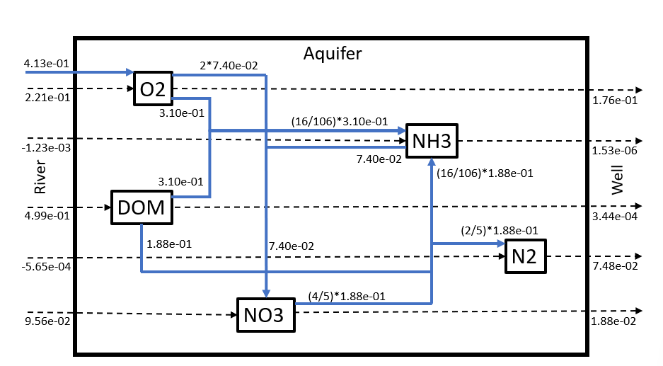

```{r, message=FALSE, echo=FALSE, eval=!knitr::opts_knit$get("child")}
res <- knitr::knit_child('methods.Rmd', quiet = TRUE)
```


# Results
To predict the concentrations of dissolved organic matter (DOM), $O_2$, $NO_3$, $NH_3$ and $N_2$ along the flow path of water from the river through the aquifer, a numerical model simulation has been performed. In this model, the contaminant transport in riverbank filtration is influenced by the different processes mentioned before. In the simulation, the flow condition between the river and the pumping well is idealized as a one-dimensional horizontal flow. The results of the simulations are shown in figure 3.

To start, five state variables are plotted with the assumed parameters. The concentrations of the state variables are plotted as a function of the distance along the aquifer. The DOM shows an exponential decrease along the length of the aquifer the further from the river.  The $NO_3$ concentration decreases quickly at a short distance (~100 m) from the river. At 150 meters it reaches its lowest concentration, then the concentration bounces back a little. After 370 meters a new steady state of 0.02 $mol/m^3$ is reached.  The $NH_3$ concentration shows a steep increase near the river, with its peak at 100 meters. After this peak, the concentration declines at the same rate, until it reaches zero at 320 meters. The $O_2$ concentration declines within 20 meters from the river from 0.2 to almost 0.0 $mol/m^3$. At a distance of 120 meters from the river, the concentration starts to increase slowly at first but further in the aquifer the rate increases. In the aquifer, the $N_2$ concentration starts at zero, increases sharply in the beginning, and flattens out after that. Until a new steady state is reached of 0.08 $mol/m^3$ at 300 meters.


```{r, echo=FALSE}
std <- steady.1D (y=state.ini, func=Aquifer, parms=parms, 
                   nspec=nspec, dimens=N, names=SVnames,
                   positive = TRUE)    
```


```{r, fig.height=8, fig.width = 12, fig.cap= "The concentration of (DOM), $O_2$, $NO_3$, $NH_3$, and $N_2$ in ($mol/m^3$) is plotted against the distance along the aquifer in (m).", echo=FALSE}

plot(std, grid=Grid$x.mid, lty=1, lwd=2, mfrow=c(2,3), xlab = "length (m)", ylab = "concentration (mol/m3)")


```

\newpage

After the concentrations of the different substances are predicted and shown, the processes involved in the riverbank filtration are shown in figure 4. This shows which and to what extent processes in the aquifer at a certain distance from the river are present. Mineralisation is high close to the river but decreases and becomes eight times smaller within 50 meters from the river. From this point a sudden switch takes place and the mineralisation declines almost horizontally further in the aquifer. Mineralisation stops at 400 meters from the river, where this process no longer influences the conversion of the substances. The process of denitrification shows an increase within 50 meters from the river. After the peak, it shows an exponential decrease until it reaches zero at 310 meters. This means denitrification has no influence at a distance further than 310 meters from the river. The nitrification has a small peak close to the river, then it decreases till a distance of 50 meters from the river. From that point, it has a small increase before it declines further. At 400 meters also nitrification reaches a value of zero, which means from this point it does not influence the conversion of substances. The aeration shows a doubling in amount within 50 meters from the river. It decreases slowly from 50 to 250 meters, from this point the aeration decreases quickly over the rest of the aquifer. 
\
\


```{r, fig.height=8, fig.width = 12, fig.cap= "The rates of aerobic mineralisation, denitrification, nitrification, and aeration (-) are plotted against the distance along the aquifer in (m).", echo=FALSE}

plot(std, grid=Grid$x.mid, which=c("Mineralisation", "Denitrification", "Nitrification", "Aeration"), lty=1, lwd=2, mfrow=c(2,3), xlab = "length (m)", ylab = "(rate (mol/m3/d)")


```


\newpage

## Budget

At the domain boundaries of the aquifer the fluxes are checked for the steady-state solution, see figure \ref{fig:bud}. The difference between fluxes at the lower and upper boundaries is equal to the net production rate. This verifies that the mass balance equations made in the model are correct. 

```{r, echo=FALSE}
toselect <- c("TotalMin", "TotalDen", "TotalNit", "TotalAer", "DOM.SWI.Flux", "DOM.Deep.Flux", 
              "NO3.SWI.Flux", "NO3.Deep.Flux", "NH3.SWI.Flux", "NH3.Deep.Flux", "O2.SWI.Flux", "O2.Deep.Flux",
              "N2.SWI.Flux", "N2.Deep.Flux")
BUDGET1  <- data.frame(TOTALandFLUX = unlist(std[toselect]))
BUDGET   <- std[toselect]
knitr::kable(BUDGET1)
```

The amount of $O_2$ that enters the aquifer from the river and via aeration is 6.34e-01 $mol/m^3/d$. The fraction of this flux utilized for mineralisation is 0.49 and for nitrification 0.23. The amount of (organic N) DOM that enters the aquifer from the river is (16/106)*4.99e-01 $mol/m^3/d$. The fraction of this flux removed by mineralisation is 0.62 and denitrification 0.38. The amount of $NO_3$ that enters the aquifer from the river is 9.56e-02 $mol/m^3/d$. The amount generated within the aquifer via nitrification is 7.40e-02 $mol/m^3/d$. The fraction of this incoming flux removed by denitrification is 0.89. The fraction of the fixed nitrogen that enters the aquifer from the river that is converted to $N_2$ gas is 0.13.


{width=70%}

\newpage

## Calibration
In the simulation of the DOM the initial value in the model had to be adjusted from a value of 0.5 $mol/m^3$ to 0.35 $mol/m^3$. The dotted blue lines in figures 6,7,8 of DOM and $NH_3$, suggest the location of a well from which water suitable for drinking could be extracted. For DOM this distance lies approximately around 40 meters for both the simulated and the calibrated line. For the calibration of the $NH_3$ concentration-length profile, the rate of nitrification had to be adjusted. In the model this rate was overestimated, in reality the rate was approximately 2 times smaller. This means the process of nitrification occurs less fast than was predicted according to the model. Therefore the peak concentration of $NH_3$ shifts further from the river and in the direction of the boundary of the aquifer. Also the front and tail of the $NH_3$ concentration becomes less steep than simulated due to the lower nitrification rate. Hereby the location for the well becomes much more limited for the calibrated model. During the original simulation, the well could be placed 200 meters from the river for safe drinking water. After the calibrated simulation the well must be placed at least 350 meters from the river, to prevent the $NH_3$ concentration from exceeding the threshold value for safe drinking water. Groundwater is aerated as it travels through the aquifer, to calibrate this aeration of the groundwater the $O_2$ concentration over the length of the aquifer is adjusted with the aeration rate. By adjusting this rate it was eventually found that the model also in this case overestimated the rate. According to the data the rate in the field is approximately 3 times smaller than estimated in the model. Therefore less aeration occurs in the aquifer and less $O_2$ is added to the groundwater. In the figure of oxygen the blue dotted line shows below which value the aquifer becomes anoxic, this is important for certain processes such as nitrogen fixation. The calibrated model shows this anoxic environment is present between 50 and 350 meters.
\
\
\

```{r}
data.ext <- read.table(file = "p4-data.dat", header = TRUE, sep = ",")
data.ext$DOM <- data.ext$DOM / parms[["NC"]]           #from N to C


calibration <- parms

calibration["rNitri"]     <- 0.36*24/2.3
calibration["rAer"]       <- 0.0003*24/3.3   
calibration["DOMriver"]   <- 0.5*0.70          

std2 <- steady.1D (y=state.ini, func=Aquifer, parms=calibration, 
                   nspec=nspec, dimens=N, names=SVnames,
                   positive = TRUE) 

```


```{r, fig.height=10, fig.width = 14, fig.cap= "The calibrated concentration of DOM (red line), the concentration of DOM for the original model (black line), and the threshold values for these solutes (blue dotted line).",  echo=FALSE}

plot(std, std2, grid=Grid$x.mid, lty=1, lwd=2, mfrow=NULL, xlab = "length (m)", ylab = "Concentration (mol/m3)", which = "DOM", obs = data.ext)
abline(h=(3/12), col = "blue2", lty = 2, lwd = 2)

```

```{r, fig.height=10, fig.width = 14, fig.cap= "The calibrated concentration of $NH_3$ (red line), the concentration of $NH_3$ for the original model (black line), and the threshold values for these solutes (blue dotted line).",  echo=FALSE}

plot(std, std2, grid=Grid$x.mid, lty=1, lwd=2, mfrow=NULL, xlab = "length (m)", ylab = "Concentration (mol/m3)", which = "NH3", obs = data.ext)
abline(h=(0.05/17), col = "blue2", lty = 2, lwd = 2)
```

```{r, fig.height=10, fig.width = 14, fig.cap= "The calibrated concentration of $O_2$ (red line), the concentration of $O_2$ for the original model (black line), and the threshold values for these solutes (blue dotted line).",  echo=FALSE}
plot(std, std2, grid=Grid$x.mid, lty=1, lwd=2, mfrow=NULL, xlab = "length (m)", ylab = "Concentration (mol/m3)", which = "O2", obs = data.ext)
abline(h=0.015, col = "blue2", lty = 2, lwd = 2)
legend("top", legend = c("Standard", "Calibration"), lty=1,lwd=2,col=1:3)

```